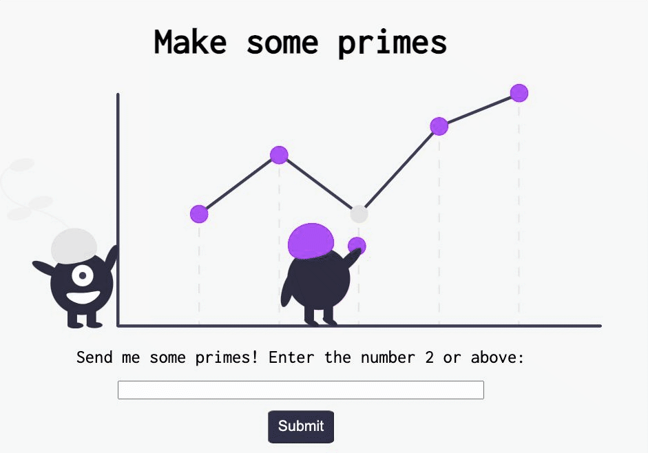
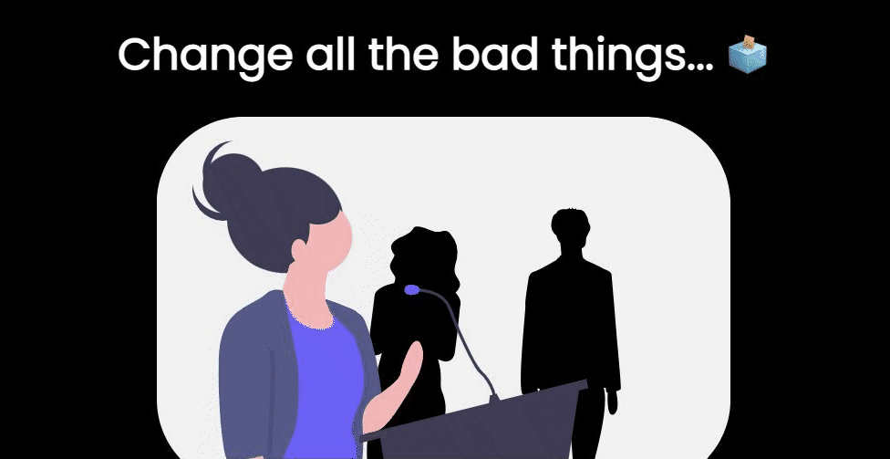
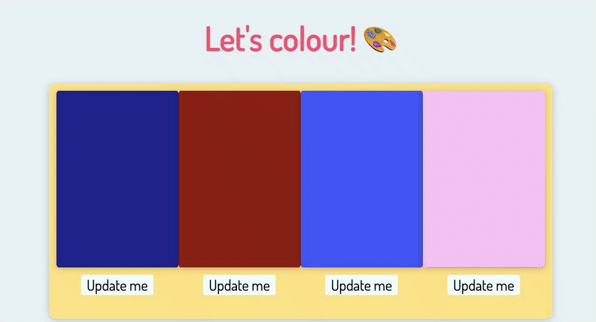
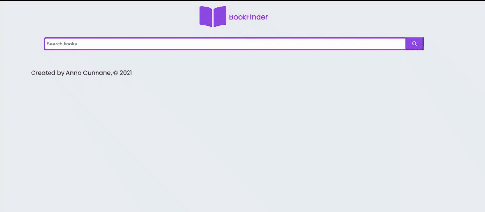
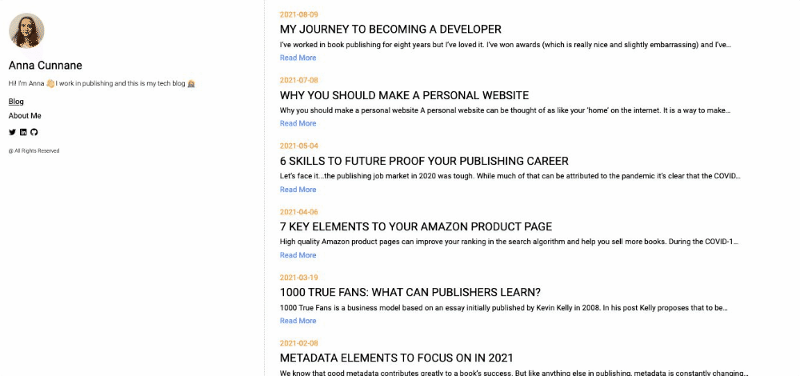

# Hi 👋 I'm Anna Cunnane

Get in touch 🐦 [Twtter](https://twitter.com/MollyBloom1989) |
📧 <a href="mailto:acunnane13@email.com"> Email</a> |
🖊️ [Blog](https://www.annacunnane.co.uk/)

Welcome to my profile!

I'm training to become a software developer
👩‍💻

I'm a member of the incoming cohort [#FAC22](https://twitter.com/hashtag/FAC22?src=hashtag_click) at [Founders and Coders](https://www.foundersandcoders.com/)
💫

Previously, I was a Metadata Mangaer in book publishing
📚

✔️ I'm learning Javascript, HTML & CSS, Typescript, RegEX and SQL 🌱

✔️ I'm currently studying on the pre-apprenticeship programme at Founders and Coders. You can see that work [here.](https://github.com/Moggach/pre-apprenticeship)

✔️ Fun fact! I'm a massive bookworm 📖 🐛

Projects:

⭐ [A prime number generator that outputs a multiplication table:](https://moggach.github.io/primes_test/)

⭐ [Change all the bad things - contact form for a social justice group:](https://github.com/Moggach/change-all-the-bad-things)

⭐ [A colour generator built in React](https://github.com/Moggach/colouring-in)

⭐ [A react app that queries the Google Books API](https://github.com/Moggach/book-finder)

⭐ [Personal blog built in Gatsby with GraphQl](https://github.com/Moggach/my-blog-site)

My latest blog posts

- [My journey to becoming a developer](https://www.annacunnane.co.uk/blog/My%20journey%20to%20become%20a%20developer)   2021-08-09
- [Why you should make a personal website](https://www.annacunnane.co.uk/blog/Why%20should%20you%20make%20a%20personal%20website)   2021-07-08
- [6 Skills to future proof your publishing career](https://www.annacunnane.co.uk/blog/6%20Skills%20to%20Future%20Proof%20your%20Publishing%20Career)   2021-05-04
- [7 key elements to your Amazon product page](https://www.annacunnane.co.uk/blog/7%20Key%20Elements%20to%20your%20Amazon%20Product%20Page)   2021-04-06
- [100 true fans: what can publishers learn?](https://www.annacunnane.co.uk/blog/100%20True%20Fans)   2021-03-19
- [Metadata elements to focus on in 2021](https://www.annacunnane.co.uk/blog/Metadata%20elements%20to%20focus%20on%20in%202021)   2021-02-08
