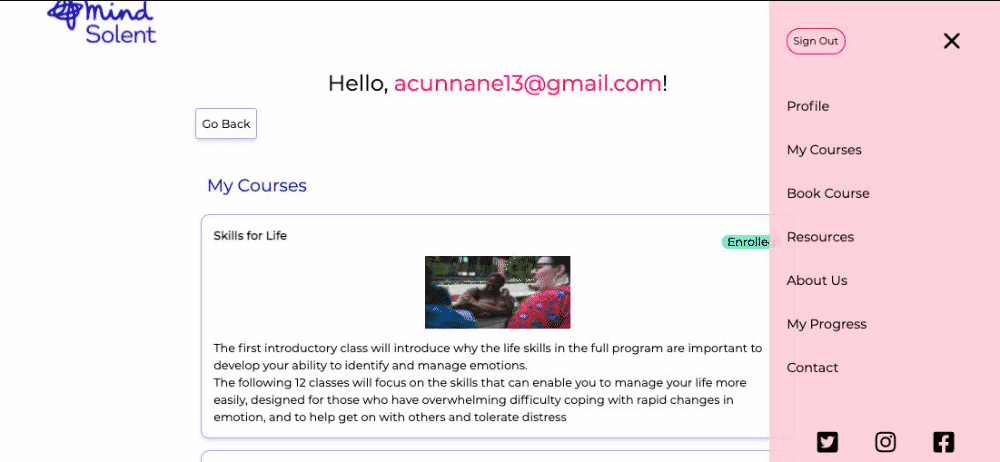

# Hi 👋 I'm Anna Cunnane

Get in touch 🐦 [Twtter](https://twitter.com/MollyBloom1989) |
📧 <a href="mailto:acunnane13@email.com"> Email</a> |
🖊️ [Blog](https://www.annacunnane.co.uk/)

Welcome to my profile!

I'm an apprentice software developer with [Common Knowledge](https://commonknowledge.coop/) 🕸️👩‍💻

I was a member of the FAC22 cohort at software development bootcamp [Founders and Coders](https://www.foundersandcoders.com/) graduating in December 2021 
💫

Projects:

⭐ [A class booking application for Solent Mind Recovery College (Part of Founders and Coders Tech for Better Project)](https://github.com/Moggach/solent-mind)

⭐ [Personal blog built in Gatsby with GraphQL](https://github.com/Moggach/my-blog-site)

⭐ [Site for comedy production company Encouraging Productions](https://github.com/Moggach/encouraging-productions)

My latest blog posts ✍️

- [Looking Back At Founders & Corders](https://www.annacunnane.co.uk/blog/Looking%20back%20at%20Founders%20and%20Coders)   2022-01-01
- [Four Things I've Learnt So Far At Founders & Corders](https://www.annacunnane.co.uk/blog/Four%20Things%20I've%20Learnt%20at%20FAC)   2021-10-23
- [Attending Co-Tech Conference at SPACE4 ](https://www.annacunnane.co.uk/blog/Attending%20Co-Tech%20conference%20at%20Space4)   2021-10-09
- [My journey to becoming a developer](https://www.annacunnane.co.uk/blog/My%20journey%20to%20become%20a%20developer)   2021-08-09
- [Why you should make a personal website](https://www.annacunnane.co.uk/blog/Why%20should%20you%20make%20a%20personal%20website)   2021-07-08

